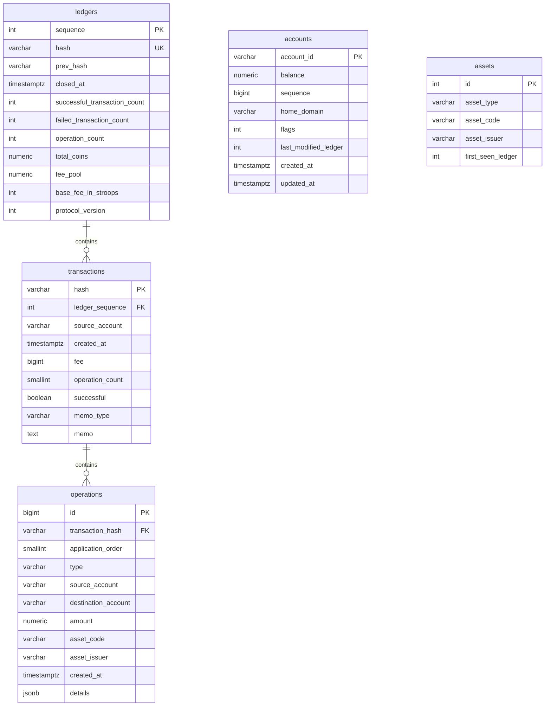

# AstroML Raw Data Storage Schema

## Overview

AstroML stores raw Stellar blockchain data in PostgreSQL. The schema models the five core entities needed for dynamic graph ML: **ledgers**, **transactions**, **operations**, **accounts**, and **assets**.

The graph mapping is:

| Blockchain Concept | Graph Representation | Table |
|--------------------|---------------------|-------|
| Accounts | Nodes | `accounts` |
| Operations | Directed edges | `operations` |
| Assets | Edge types | `assets` |
| Time (ledger close) | Dynamic dimension | `ledgers` |

## ER Diagram



## Table Details

### `ledgers`

Temporal anchor — one row per closed Stellar ledger (~5-6 seconds apart).

**Indexes:**
- `PK` on `sequence`
- `UNIQUE` on `hash`
- `ix_ledgers_closed_at` on `closed_at`

### `transactions`

One row per Stellar transaction. Linked to a ledger via `ledger_sequence`.

**Indexes:**
- `PK` on `hash`
- `ix_transactions_source_account_created_at` on `(source_account, created_at)` — composite index for account+timestamp queries
- `ix_transactions_ledger_sequence` on `ledger_sequence`

### `operations`

One row per operation — the primary graph-edge table. Common columns (`source_account`, `destination_account`, `amount`, `asset_code`, `asset_issuer`) cover the majority of graph-relevant operation types. The `details` JSONB column stores type-specific fields.

`created_at` is denormalized from the parent transaction to support efficient temporal range queries without JOINs.

**Indexes:**
- `PK` on `id`
- `ix_operations_source_created_at` on `(source_account, created_at)` — composite index for account+timestamp queries
- `ix_operations_dest_created_at` on `(destination_account, created_at)` — partial index (WHERE destination_account IS NOT NULL)
- `ix_operations_transaction_hash` on `transaction_hash`
- `ix_operations_type` on `type`

### `accounts`

Latest known state of a Stellar account.

**Indexes:**
- `PK` on `account_id`
- `ix_accounts_updated_at` on `updated_at`

### `assets`

Asset registry — unique by (code, issuer). Native XLM has `asset_issuer = NULL`.

**Indexes:**
- `PK` on `id`
- `ix_assets_code_issuer` on `(asset_code, COALESCE(asset_issuer, ''))` — unique expression index handling NULL issuer for native XLM

## Relationships

```
ledgers  1 ──< N  transactions  (ledger_sequence → sequence)
transactions  1 ──< N  operations  (transaction_hash → hash)
```

`accounts` and `assets` are reference tables — not FK-constrained from operations to keep bulk ingestion fast and avoid ordering dependencies.

## Running Migrations

```bash
# Apply all migrations
alembic upgrade head

# Rollback all migrations
alembic downgrade base

# Create a new migration
alembic revision --autogenerate -m "description"
```
